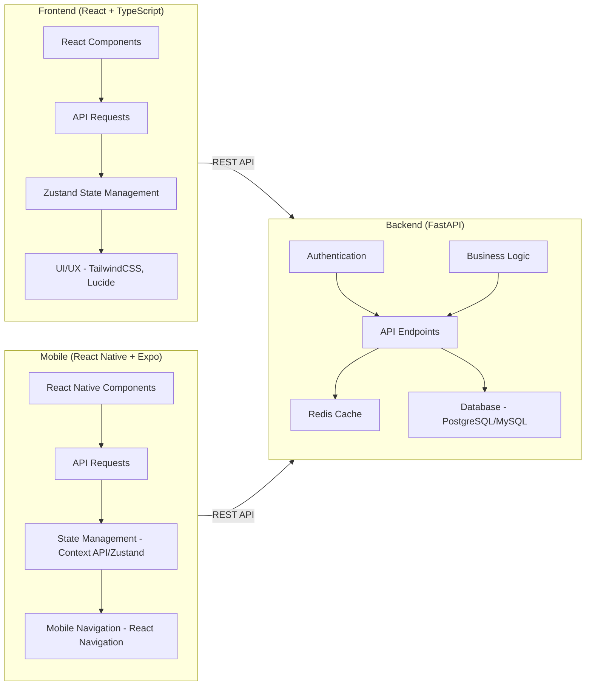

# Sistema de Gerenciamento de Manutenção

Este é um sistema completo de gerenciamento de manutenção, construído com uma arquitetura moderna e escalável, que abrange backend (FastAPI), frontend (React com TypeScript) e mobile (React Native com Expo). O sistema permite o gerenciamento de máquinas, manutenções, peças e equipes, fornecendo uma solução integrada para otimizar as operações de manutenção.

## Arquitetura do Sistema



## Stacks Utilizadas

**Backend:**

[](https://fastapi.tiangolo.com/)
[](https://www.python.org/)
[](https://redis.io/)
[](https://python-poetry.org/)
[](https://www.uvicorn.org/)

**Frontend:**

[](https://reactjs.org/)
[](https://www.typescriptlang.org/)
[](https://tailwindcss.com/)
[](https://vitejs.dev/)
[](https://lucide.dev/)
[](https://zustand-demo.pmnd.rs/)

**Mobile:**

[](https://reactnative.dev/)
[](https://expo.dev/)
[](https://www.typescriptlang.org/)
[](https://reactnavigation.org/)
[](https://axios-http.com/)

## Funcionalidades

* **Gerenciamento de Máquinas:** Cadastro, atualização, exclusão e visualização de máquinas com informações detalhadas, incluindo histórico de manutenção.
* **Gerenciamento de Manutenções:** Registro de novas manutenções, atribuição de equipes, acompanhamento do status e histórico de manutenções por máquina.
* **Gerenciamento de Peças:** Controle de estoque, cadastro de novas peças, atualização de quantidades e informações de fornecedores.
* **Gerenciamento de Equipes:** Criação de equipes de manutenção, atribuição de membros e especialidades.
* **Autenticação de Usuários:** Sistema de login e cadastro de usuários com segurança.
* **Dashboard com Estatísticas:** Visão geral das principais métricas do sistema, como total de máquinas, equipes, manutenções e visitas. (Frontend)
* **Testes Unitários e de Integração:** Garantia de qualidade do código através de testes automatizados. (Backend)

## Rodando o Projeto

### Backend

1. Navegue até a pasta `backend`.
2. Instale as dependências: `poetry install`
3. Rode o servidor: `poetry run uvicorn main:app --reload`

### Frontend

1. Navegue até a pasta `frontend`.
2. Instale as dependências: `npm install`
3. Rode o projeto: `npm run dev`

### Mobile

1. Navegue até a pasta `mobile`.
2. Instale as dependências: `npm install` ou `yarn`
3. Rode o projeto: `npm start`
4. Coloque seu IP público no arquivo `services/api.ts`.

### Docker

1. Certifique-se de ter o Docker e o Docker Compose instalados.
2. Na raiz do projeto, execute: `docker-compose up --build`

### Se tiveres Linux

1. Na raiz do projeto, execute: `chmod +x ./start.sh`
2. Então execute `./start.sh`
3. Não esqueça de colocar seu IP público na pasta `mobile/services/api.ts`
   
## Estrutura de Pastas

```
├── .gitignore
├── README.Docker.md
├── backend
│   ├── Dockerfile
│   ├── ... (código do backend)
├── compose.yaml
├── frontend
│   ├── Dockerfile
│   ├── ... (código do frontend)
├── mobile
│   ├── Dockerfile
│   ├── ... (código do mobile)
└── README.md
```

## Licença

[MIT](LICENSE)

## Contato

Vincenzo Amendola - vincenzo.amendola141@gmail.com

## Screenshots

### Backend - API Routes
**Descrição:** Documentação dos endpoints da API.


### Frontend - Telas

**Home Screen:** Página inicial do sistema.  


**Login Screen:** Tela de login de usuários.  


**SignUp Screen:** Tela de cadastro de novos usuários.  


**Dashboard Screen:** Visão geral das métricas do sistema.  


**Machines Screen:** Listagem de máquinas cadastradas.  


**Create Machines Screen:** Formulário de criação de novas máquinas.  


**Maintenance Screen:** Listagem de manutenções.  


**Create Maintenance Screen:** Formulário de criação de manutenção.  


**Parts Screen:** Listagem de peças.  


**Create Parts Screen:** Formulário de criação de peças.  


**Teams Screen:** Listagem de equipes.  


**Create Teams Screen:** Formulário de criação de equipes.  


### Mobile - Telas

**Maintenance Screen (Mobile):** Tela de manutenção no aplicativo móvel.  


**Machine Screen (Mobile):** Tela de detalhes da máquina no aplicativo móvel.  


**Parts Screen (Mobile):** Tela de listagem de peças no aplicativo móvel.  


**Teams Screen (Mobile):** Tela de equipes no aplicativo móvel.  


---- Acesse o Vídeo de Demonstração ----
